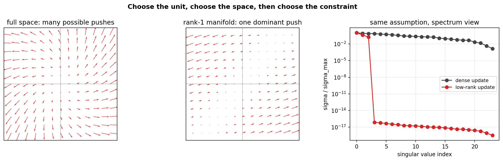
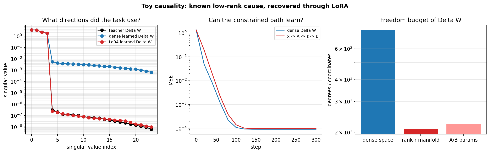

# LoRA as Clinical Adaptation Geometry

I come from fMRI research, where the central question was often how a
high-dimensional biological signal can be explained by a smaller latent
structure.

Recent neuroscience foundation models, such as TRIBE v2, make that question
feel even more alive: can we build models that do not only analyze biological
signals, but help us simulate, probe, and reason about biological systems?

This project takes a more focused, practical step toward that direction. Instead
of reproducing a large multimodal brain foundation model, I use LoRA as a
compact case study for the same habit of thought:

> What is the unit of adaptation, what space does it live in, and what
> constraint explains the observed change?

The answer I test here is:

```text
unit of change : Delta W, the task-induced displacement of a frozen operator
space          : Delta W in R^(out x in)
dense cause    : Delta W can move anywhere in that space
LoRA cause     : Delta W must pass through x -> A -> z_task -> B
constraint     : rank(Delta W) <= r
observable     : singular-value energy collapse
```

The goal is not to build a large framework. The goal is to show how I read a
paper: define the causal unit, count its freedom, constrain the connection
space, implement the smallest tensor flow, and then ask whether the same trace
appears in a real clinical adaptation task.

---

## Modeling Protocol

This repo follows one top-down modeling protocol.

```text
1. Observe a phenomenon.
   A new medical task changes the behavior of a pretrained model.

2. Choose the unit of change.
   The unit is not accuracy and not the whole model. It is Delta W.

3. Define the space.
   For one linear operator, Delta W lives in R^(out x in).

4. Compare causal assumptions.
   Full fine-tuning lets Delta W use the whole dense space.
   LoRA assumes the change passes through a small task coordinate z_task.

5. Express the constraint.
   A: input space -> r task coordinates
   B: r task coordinates -> output displacement
   Delta W = (alpha / r) * B A

6. Decide what should be observable.
   If the assumption is right, the learned Delta W should have few active
   singular directions.

7. Test twice.
   Toy world: the cause is known.
   Clinical world: the cause is unknown, so I look for the trace.
```

This is the link to my fMRI background. In fMRI, I learned to move between a
high-dimensional observation, a chosen representation space, and a smaller set
of latent directions. Here I apply the same habit to model adaptation.

---

## Code Structure

The structure follows the tensor and reasoning flow, not a package template.

```text
main.py          # runs the modeling protocol
model.py         # W0, DenseAdapter, LoRALinear, toy teacher world
ops.py           # freedom counts, rank energy, SVD, subspace checks
utils.py         # seed, device, json, paths, printing helpers
requirements.txt
```

`model.py` contains the core connection flow:

```text
x -> A -> z_task -> B -> update

x       : (batch, in)
A       : (rank, in)
z_task  : (batch, rank)
B       : (out, rank)
Delta W : (out, in)
```

The important object is still `Delta W`, but LoRA forces it to be generated
through the `z_task` bottleneck. That is where the modeling assumption enters
the tensor graph.

`ops.py` keeps the interpretation honest by counting the freedom:

```text
dense Delta W freedom = out * in
LoRA raw coordinates  = rank * in + out * rank
rank-r manifold dim   = rank * (out + in - rank)
gauge redundancy      = rank^2
```

So `A` and `B` are not treated as the final truth. They are coordinates that
generate a constrained `Delta W`.

---

## Run

Install:

```bash
python3 -m pip install -r requirements.txt
```

Run the small stages locally:

```bash
python3 main.py --stage intuition
python3 main.py --stage toy
```

Regenerate the clinical figure from saved Colab outputs:

```bash
python3 main.py --stage clinical-figure
```

Run the full clinical training on Colab/T4:

```bash
python3 main.py --stage real
```

If Colab has an old `torchao` package that conflicts with PEFT:

```bash
pip uninstall -y torchao
```

Then restart the session and reinstall requirements.

---

## Visual Trail

The outputs are deliberately few.

```text
visualization/intuition_low_rank.png
visualization/toy_lora_recovery.png
visualization/clinical_lora_bridge.png
```






---

## What The Clinical Figure Means

The clinical bridge explores a core question in medical adaptation:

> Is a new classifier head enough, or does the frozen ViT need a few internal
> task-specific directions?

For a ViT q/v projection with shape `768 x 768`, one dense update has 589,824
degrees of freedom. A LoRA update with `r=8` uses 12,288 raw A/B coordinates
and lies on a rank-8 manifold.

In the current run, LoRA outperformed the linear probe on the same frozen
backbone. More importantly, the learned `Delta W` spectrum collapsed: although
the trained LoRA rank was `r=8`, roughly 90% of the update energy concentrated
around the first few singular directions.

That does not prove a universal law. It is a compact case study showing how I
would justify a fine-tuning strategy: choose the unit, constrain the space,
train the model, inspect the learned update, and connect the result back to
the geometry of adaptation.

---

## Why This Fits Medical AI

The Acryl role asks for medical AI research, multimodal pipelines, model
evaluation, and LoRA or full fine-tuning experience. My direct research
background is fMRI and linear modeling, but the transferable skill is the habit
of finding structure inside high-dimensional biological systems.

This project is my bridge:

```text
fMRI skill:
choose a representation space for noisy biological data

fine-tuning skill:
choose the unit and constraint of model adaptation

clinical AI skill:
turn that assumption into a strategy, then test its trace on medical data
```

I want the code to show not only that I can use LoRA, but that I can reason
about why LoRA might be the right move for a medical foundation model.

---

## References

Hu, E. J. et al. *LoRA: Low-Rank Adaptation of Large Language Models.*
arXiv:2106.09685, 2021.

Aghajanyan, A. et al. *Intrinsic Dimensionality Explains the Effectiveness of
Language Model Fine-Tuning.* ACL, 2021.

Yang, J. et al. *MedMNIST v2: A Large-Scale Lightweight Benchmark for 2D and 3D
Biomedical Image Classification.* Scientific Data, 2023.

Meta Fundamental AI Research. *A Foundation Model of Vision, Audition and Language for In Silico Neuroscience.*
[Link](https://ai.meta.com/research/publications/a-foundation-model-of-vision-audition-and-language-for-in-silico-neuroscience/)
