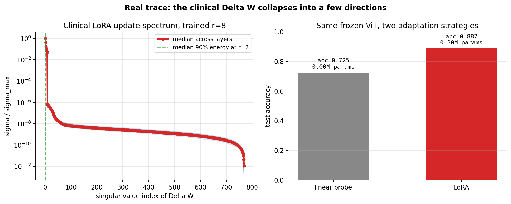

# Analyzing Parameter-Efficient Fine-Tuning Geometry in Medical Vision Transformers

This project explores the mathematical geometry and parameter efficiency of **LoRA (Low-Rank Adaptation)** in Vision Transformers (ViTs) applied to medical image classification.

---

## 1. Core Philosophy: Transferable Data Science Mindset

This project is built on a shared analytical approach between neuroscience data analysis and deep learning:

* **fMRI Research Background:** In functional brain imaging (fMRI), we analyze high-dimensional voxel activation patterns by mapping them onto low-dimensional functional networks to identify core cognitive states.
* **LoRA Weight Adaptation:** We apply the same habit of thought to model adaptation. Instead of treating LoRA simply as a memory-saving technique, we analyze the weight displacement tensor ($\Delta W$) using Singular Value Decomposition (SVD) to inspect whether the model's adaptation dynamics are compressed into a low-dimensional task subspace.

---

## 2. Key Concepts

To understand how fine-tuning behaves geometrically, we define three key concepts:

### A. Weight Displacement ($\Delta W$) as the Unit of Change
When a model adapts to a new medical domain, we isolate the weight update itself rather than looking at final weight values or raw validation loss:
$$\Delta W = W_{\text{new}} - W_0$$
This displacement is the **unit of change** that carries the adaptation. Performing SVD on $\Delta W$ lets us analyze the dimensionality of the task-specific update trajectory.

### B. Subspace Bottleneck ($z_{task}$)
LoRA assumes that task-specific adaptation is constrained to a low-dimensional subspace. When inputs $x$ pass through the layer, the computation flows through a bottleneck:
$$x \longrightarrow A \longrightarrow z_{task} \longrightarrow B \longrightarrow \text{update}$$
* **$A$ (Down-projection):** Maps the input to the task-specific subspace coordinate $z_{task} = x \cdot A$.
* **$B$ (Up-projection):** Projects the coordinate back to the output space.
* This limits the weight update to a rank-$r$ manifold: $\Delta W = \frac{\alpha}{r} (B \cdot A)$.

### C. Spectrum Collapse
If the low-rank assumption holds, the singular values of $\Delta W$ should decay rapidly, indicating that the task adaptation only needs a few principal directions. This concentration of energy in the first few singular directions is called **Spectrum Collapse**.

---

## 3. Code Structure

The repository is organized to follow this analytical pipeline:

* **[main.py](file:///Users/yuseon/Library/CloudStorage/GoogleDrive-yuseon.cognitive%20@gmail.com/My%20Drive/3M_SPRINT/Core_Architecture_Implement_Carpedem/learn_and_create/create/LoRA_geometry/main.py)**: Runner script that manages the data pipeline and runs the evaluation stages.
* **[model.py](file:///Users/yuseon/Library/CloudStorage/GoogleDrive-yuseon.cognitive%20@gmail.com/My%20Drive/3M_SPRINT/Core_Architecture_Implement_Carpedem/learn_and_create/create/LoRA_geometry/model.py)**: Implements [LoRALinear](file:///Users/yuseon/Library/CloudStorage/GoogleDrive-yuseon.cognitive%20@gmail.com/My%20Drive/3M_SPRINT/Core_Architecture_Implement_Carpedem/learn_and_create/create/LoRA_geometry/model.py#L42-L120) and [DenseAdapter](file:///Users/yuseon/Library/CloudStorage/GoogleDrive-yuseon.cognitive%20@gmail.com/My%20Drive/3M_SPRINT/Core_Architecture_Implement_Carpedem/learn_and_create/create/LoRA_geometry/model.py#L121-L142) wrappers.
* **[ops.py](file:///Users/yuseon/Library/CloudStorage/GoogleDrive-yuseon.cognitive%20@gmail.com/My%20Drive/3M_SPRINT/Core_Architecture_Implement_Carpedem/learn_and_create/create/LoRA_geometry/ops.py)**: Contains mathematical utilities for SVD, rank energy decay, and subspace projections.
* **[utils.py](file:///Users/yuseon/Library/CloudStorage/GoogleDrive-yuseon.cognitive%20@gmail.com/My%20Drive/3M_SPRINT/Core_Architecture_Implement_Carpedem/learn_and_create/create/LoRA_geometry/utils.py)**: Shared utilities for devices, seeds, and directory path management.

### Key Metrics Tracked (in [ops.py](file:///Users/yuseon/Library/CloudStorage/GoogleDrive-yuseon.cognitive%20@gmail.com/My%20Drive/3M_SPRINT/Core_Architecture_Implement_Carpedem/learn_and_create/create/LoRA_geometry/ops.py)):
* **[subspace_alignment](file:///Users/yuseon/Library/CloudStorage/GoogleDrive-yuseon.cognitive%20@gmail.com/My%20Drive/3M_SPRINT/Core_Architecture_Implement_Carpedem/learn_and_create/create/LoRA_geometry/ops.py#L114-L128)**: Measures how well the learned weight update matches the true task subspace.
* **[rank_for_energy](file:///Users/yuseon/Library/CloudStorage/GoogleDrive-yuseon.cognitive%20@gmail.com/My%20Drive/3M_SPRINT/Core_Architecture_Implement_Carpedem/learn_and_create/create/LoRA_geometry/ops.py#L110-L113)**: Determines the minimum rank required to cover $90\%$ of the total update energy.
* **[freedom_report](file:///Users/yuseon/Library/CloudStorage/GoogleDrive-yuseon.cognitive%20@gmail.com/My%20Drive/3M_SPRINT/Core_Architecture_Implement_Carpedem/learn_and_create/create/LoRA_geometry/ops.py#L32-L64)**: Computes parameter counts and effective manifold dimensions to measure efficiency.

---

## 4. Run & Execution

The workflow runs in two stages:

### A. Toy Subspace Recovery (`--stage toy`)
A controlled simulation where a synthetic weight update is low-rank. We train both a dense and a low-rank adapter to evaluate if the constrained adapter successfully recovers the target subspace.
```bash
python3 main.py --stage toy
```

### B. Clinical Adaptation Analysis (`--stage real` / `clinical-figure`)
Fine-tunes a pre-trained Vision Transformer (ViT) on PneumoniaMNIST (MedMNIST) for chest X-ray image classification using PEFT LoRA. We extract the learned $\Delta W$ across layers and analyze their SVD spectra.
```bash
# Run training on medical dataset (requires GPU)
python3 main.py --stage real

# Or generate plots directly using pre-saved Colab metrics
python3 main.py --stage clinical-figure
```

---

## 5. Macro Results & Takeaways

The empirical results from our clinical image adaptation runs demonstrate:

1. **Spectrum Collapse:** Across all fine-tuned layers in the ViT encoder, the singular values of $\Delta W$ decay exponentially. Although trained with rank $r=8$, **more than 90% of the update energy is concentrated in the first 2 to 3 singular directions**.
2. **Layer-wise Rank Requirements:** Shallow layers (L0-L4) require a very low rank ($r \le 3$) to capture 90% of the adaptation energy, while deeper layers require slightly higher capacity.



### Macroscopic Takeaway for Clinical VLMs
These empirical results justify the use of **Adaptive Rank Allocation** (e.g., AdaLoRA) in medical multimodal architectures. Instead of allocating a uniform rank (like $r=8$) to all projection layers across the model, we can prune ranks in shallow layers to save parameter budget, focusing capacity on deep multimodal projection layers where multi-modal representations are aligned.

---

## Installation

```bash
pip install -r requirements.txt
```
*(Note: If running on Google Colab and encountering conflicts with `torchao` and `peft`, run `pip uninstall -y torchao`, restart the session, and reinstall requirements).*
